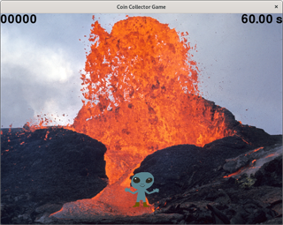
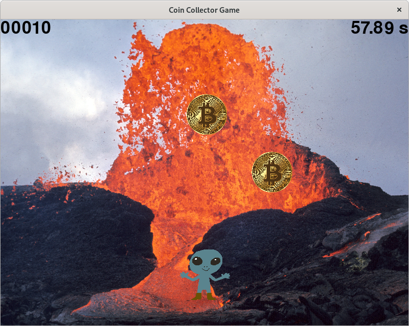
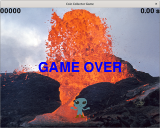

CoinCollecterはコインを獲得するゲームです。

# 環境

- python 3.10

# インストール

```bash:インストール
git clone https://github.com/ykoizumi500/CoinCollector.git
python -m pip install -r requirements.txt
```

# 使い方

```bash:実行
python -m coin_collector
```

## ゲーム開始画面


スペースキーでゲームを始めます。

## ゲーム中画面


ゲーム中は矢印キーで移動できます。
コインを獲得すると、時間と得点が加算されます。
エスケープキーで終了します。

# ゲーム終了画面


時間切れになるとこの画面になります。
エンターキーで再開します。

# 使用画像

画像は
[パブリックドメインQ](https://publicdomainq.net/)
から引用しました。
